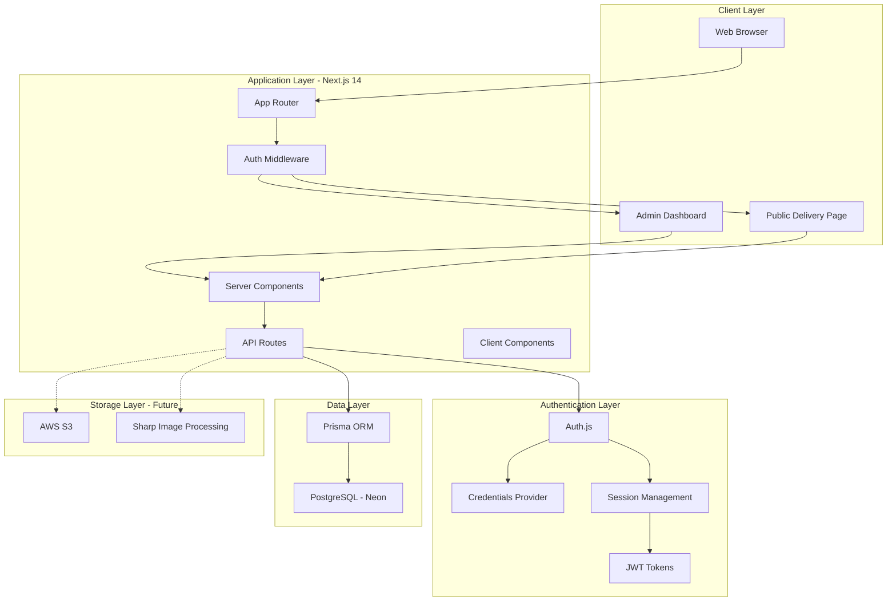
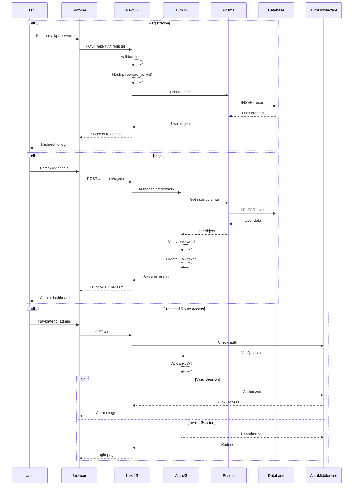
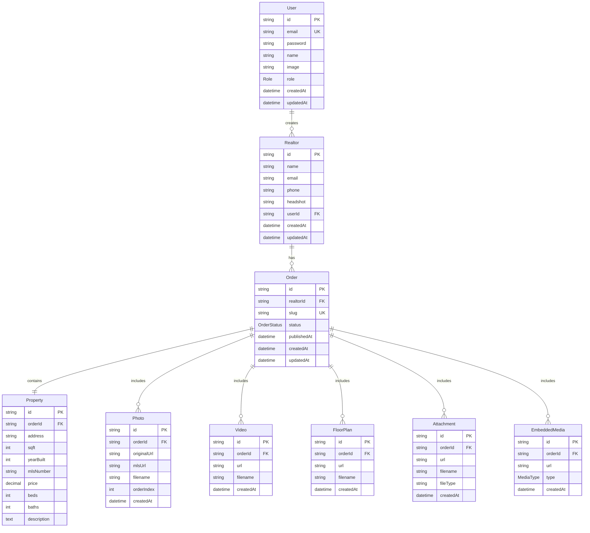
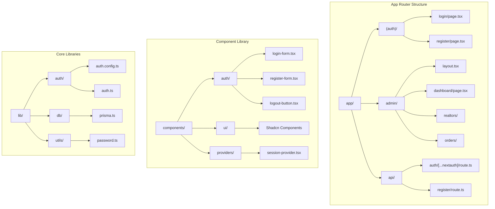
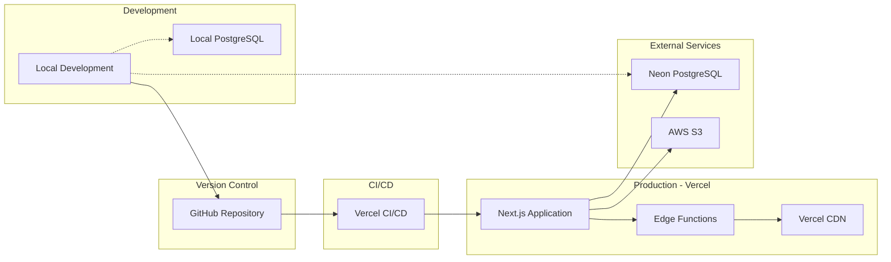
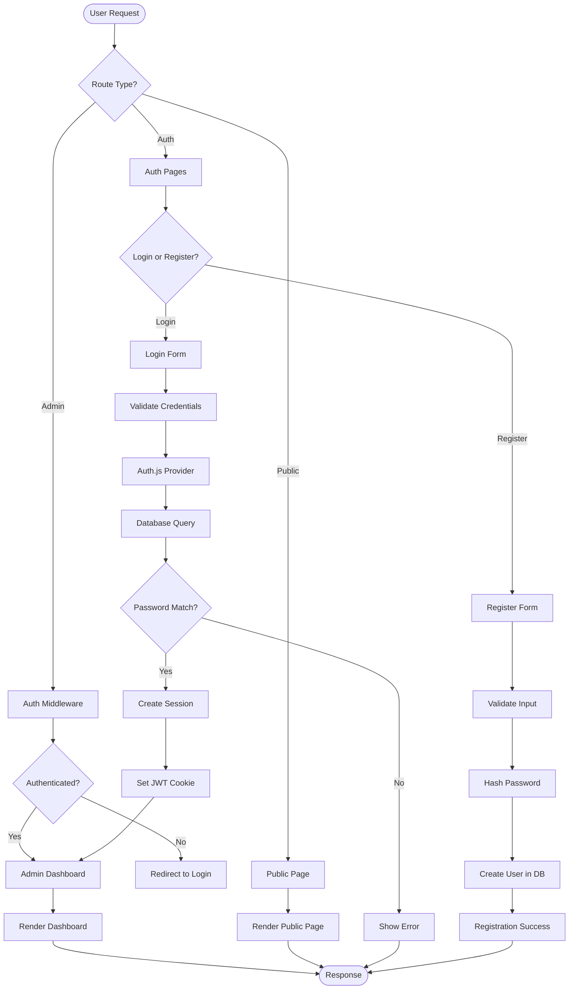
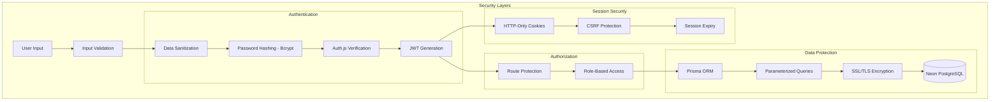
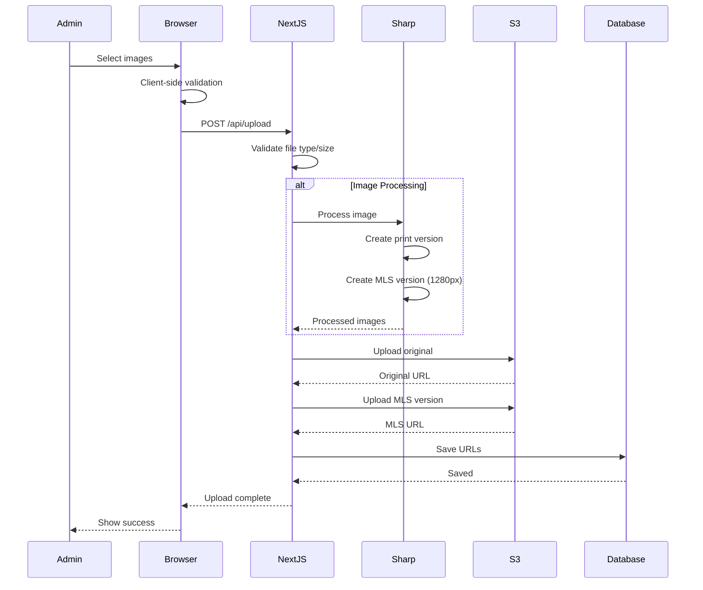

# System Architecture Diagrams

## Overall System Architecture

## Authentication Flow

## Database Schema

## Component Architecture

## Deployment Architecture

## Request Flow for Milestone 1

## Security Architecture

## File Upload Flow (Future Implementation)

